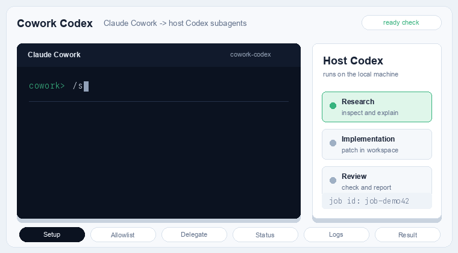

# Cowork Codex

Cowork Codex gives Fable in Claude Cowork a Codex research and implementation subagent: the Codex CLI already installed and authenticated on your host machine. Fable coordinates; Codex researches, implements, reviews, and reports back in configured workspaces.

Use it to delegate research and implementation work to Codex while keeping the main Cowork thread lighter and conserving context and tokens.



Cowork Codex is an unofficial community plugin and is not affiliated with OpenAI or Anthropic.

Current 0.1.x releases are tested on macOS hosts. Linux and Windows support is implemented for direct host paths and standard Node/Codex installs, but still needs real Cowork-session validation.

It is designed for the Cowork host/VM split: Codex runs on the host where it is already authenticated, while Cowork can start tasks, reviews, resumes, and cancellations through a bundled stdio MCP server.

## What You Get

- `/review` for a normal read-only Codex review.
- `/adversarial-review` for a steerable challenge review.
- `/delegate`, `/status`, `/result`, and `/cancel` to delegate research or implementation work and manage background jobs.
- `/setup` for host Codex readiness checks.
- `/concurrency` to change the active Codex job cap, which defaults to 8.
- `/allowlist` to show or update the workspace folders Codex jobs can use.
- `/logs` to inspect bounded stdout, stderr, or event-log tails for a job.
- A `codex-prompting` skill for compact implementation, research, and diagnosis handoffs.

## Requirements

- Node.js 18.18 or newer.
- Authenticated Codex CLI on the host machine.
- Claude plugin environment that resolves `${CLAUDE_PLUGIN_ROOT}` in `.mcp.json`.

## Quick Install

Create the local config with at least one workspace folder.

Linux/macOS:

```bash
mkdir -p ~/.config/cowork-codex
cat > ~/.config/cowork-codex/cowork-codex.local.json <<'JSON'
{
  "defaultProfile": "workspace-write",
  "cwdAllowlist": [
    "/absolute/path/to/workspace"
  ],
  "allowedProfiles": [
    "read-only",
    "workspace-write",
    "full-local-access"
  ],
  "allowlistEdits": true,
  "codexBin": null,
  "maxConcurrentJobs": 8
}
JSON
```

Windows PowerShell:

```powershell
New-Item -ItemType Directory -Force "$env:APPDATA\cowork-codex" | Out-Null
@'
{
  "defaultProfile": "workspace-write",
  "cwdAllowlist": [
    "C:\\absolute\\path\\to\\workspace"
  ],
  "allowedProfiles": [
    "read-only",
    "workspace-write",
    "full-local-access"
  ],
  "allowlistEdits": true,
  "codexBin": null,
  "maxConcurrentJobs": 8
}
'@ | Set-Content "$env:APPDATA\cowork-codex\cowork-codex.local.json"
```

Add this repo as a Claude plugin marketplace and install the plugin:

```bash
claude plugin marketplace add 5pence5/cowork-codex
claude plugin install cowork-codex@cowork-codex --scope user
```

For private forks or private review, use the SSH form instead:

```bash
claude plugin marketplace add git@github.com:5pence5/cowork-codex.git
```

The SSH form requires repo access, a loaded SSH key, and GitHub in `known_hosts`.

Run `/reload-plugins`, then verify the `cowork-codex` MCP server and tools are visible with `/mcp`.

After install, you should see:

- the slash commands listed below
- the `cowork-codex` and `codex-prompting` skills
- the `cowork-codex` MCP server in `/mcp`

You can install and run `codex_setup` before writing any config; task and review jobs stay disabled until `cwdAllowlist` contains at least one real folder.

See [docs/INSTALL.md](docs/INSTALL.md) for clone-based install, dry-run, multiple-workspace, custom Codex binary, config-only, and manual install options.

## Configuration

The installed plugin reads:

```text
Linux/macOS: ~/.config/cowork-codex/cowork-codex.local.json
Windows: %APPDATA%\cowork-codex\cowork-codex.local.json
```

Example config:

```json
{
  "defaultProfile": "workspace-write",
  "cwdAllowlist": [
    "/absolute/path/to/workspace"
  ],
  "allowedProfiles": [
    "read-only",
    "workspace-write",
    "full-local-access"
  ],
  "allowlistEdits": true,
  "codexBin": null,
  "maxConcurrentJobs": 8
}
```

Set `COWORK_CODEX_LOCAL_CONFIG` only for direct development runs when you want to point at another config file.

Fields:

- `defaultProfile`: `read-only` or `workspace-write`. Unsupported values are ignored and the bridge uses `workspace-write`.
- `cwdAllowlist`: host folders where jobs may run. Placeholder entries beginning with `<` are ignored. Change it in the JSON config, with `npm run install:cowork -- --allowlist <path>`, or from Cowork with `/allowlist`.
- `allowedProfiles`: optional list of Codex profiles callers may use. Defaults to all supported profiles.
- `allowlistEdits`: optional boolean for Cowork-side `/allowlist` changes. Defaults to `true`.
- `codexBin`: optional absolute Codex binary path. Leave `null` to auto-discover.
- `maxConcurrentJobs`: active Codex job cap. Defaults to 8 and is clamped from 1 to 8. Change it in the JSON config, with `npm run install:cowork -- --max-concurrent-jobs <n>`, or from Cowork with `/concurrency <n>`.

`cwdAllowlist` may point at an exact workspace or a parent folder. For Cowork VM paths such as `/sessions/<session>/mnt/<workspace>`, the bridge first tries host-absolute mapping and then maps the VM workspace basename back onto matching allowlisted host folders. Ambiguous mappings are rejected; use a host-absolute path or narrow the allowlist.

## Usage

### `/review`

Runs a normal Codex review. It uses the same Codex review path as `codex exec review` when no focus text is supplied.

Examples:

```bash
/review
/review --base main
/review --background
```

This command is read-only. When run in the background, use `/status` to check progress and `/result` to read the final output.

### `/adversarial-review`

Runs a steerable review that questions the chosen implementation and design.

Use it when you want a review focused on design choices, tradeoffs, hidden assumptions, failure modes, or a specific focus area.

Examples:

```bash
/adversarial-review
/adversarial-review --base main challenge whether this was the right caching and retry design
/adversarial-review --background look for race conditions and question the chosen approach
```

This command is read-only. It does not fix code.

### `/delegate`

Hands a research or implementation task to host Codex.

It supports `--background`, `--wait`, `--resume`, `--fresh`, `--model`, `--effort`, and `--profile`.

Examples:

```bash
/delegate investigate why the tests started failing
/delegate fix the failing test with the smallest focused patch
/delegate --resume latest apply the top fix from the last run
/delegate --background research the best way to add Windows path support
```

If you omit `--resume` and `--fresh`, the bridge starts a new Codex task. Use `/status`, `/result`, and `/cancel` for background jobs.

### `/status`

Shows running and recent Codex jobs.

Examples:

```bash
/status
/status job-abc123
```

### `/result`

Shows the final stored Codex output for a finished job. Without an id, it returns the latest completed, failed, cancelled, or rejected job. When available, it includes the Codex session id so you can reopen that run directly in Codex.

Examples:

```bash
/result
/result job-abc123
```

### `/logs`

Shows a bounded tail from a job log stream.

Examples:

```bash
/logs job-abc123
/logs job-abc123 err
/logs job-abc123 events --tail-bytes 32768
```

### `/cancel`

Cancels an active background Codex job.

Examples:

```bash
/cancel job-abc123
```

### `/setup`

Checks whether host Codex is installed, authenticated, and visible to the plugin.

### `/concurrency`

Shows or changes the active Codex job cap.

Examples:

```bash
/concurrency
/concurrency 8
```

### `/allowlist`

Shows or changes the configured host workspace folders.

Examples:

```bash
/allowlist
/allowlist add /Users/me/Projects/app
/allowlist remove /Users/me/Old/app
/allowlist set /Users/me/Projects/app-one /Users/me/Projects/app-two
```

The plugin also exposes these MCP tools:

- `codex_setup`
- `codex_set_max_concurrent_jobs`
- `codex_cwd_allowlist`
- `codex_delegate`
- `codex_start_task`
- `codex_start_review`
- `codex_job_status`
- `codex_job_result`
- `codex_job_logs`
- `codex_cancel_job`

## Typical Flows

### First Sanity Check

```bash
/setup
/review --background
/status
/result
```

### Review Before Shipping

```bash
/review
/review --base main
/adversarial-review --base main challenge whether this was the right implementation approach
```

Use `/review` for the normal Codex review pass. Use `/adversarial-review` when you want Codex to question the design, assumptions, tradeoffs, or a specific risk area.

### Hand A Problem To Codex

```bash
/delegate investigate why the build is failing in CI
/delegate fix the failing test with the smallest focused patch
/delegate --background research the best way to migrate this module to the new API
```

This is the main Cowork flow: Fable keeps coordinating in Cowork while Codex takes a separate research or implementation pass on the host checkout.

### Start Something Long-Running

```bash
/adversarial-review --background
/delegate --background investigate the flaky test
```

Then check in with:

```bash
/status
/result
/logs job-abc123 err
```

### Continue A Codex Run

```bash
/delegate --resume latest apply the top fix from the last run
/result
```

Use this when a Codex run found the right direction but needs one more pass.

### Tune Parallel Work

```bash
/concurrency
/concurrency 8
```

Use `/concurrency` to view or change how many Codex jobs Cowork Codex can run at once. The same value can also be set in `cowork-codex.local.json`.

### Add A Workspace

```bash
/allowlist
/allowlist add /Users/me/Projects/app
/allowlist remove /Users/me/Old/app
```

Use `/allowlist` to view or change `cwdAllowlist` from Cowork. It reports the config path, configured folders, and active existing roots.

## Codex Integration

Cowork Codex uses the global `codex` binary installed on the host and the Codex auth state already available there.

Because Cowork can provide VM paths such as `/sessions/<session>/mnt/<workspace>`, Cowork Codex maps those paths back to host folders from `cwdAllowlist`.

## Compatibility Scope

The 0.1.x line is compatibility-first. It follows the OpenAI Codex Claude Code plugin workflow where that maps cleanly to Cowork: setup, task handoff, review, resume, status, result retrieval, cancellation, and background jobs.

Current differences:

- `/delegate` is the Cowork equivalent of the OpenAI plugin's task handoff flow.
- `/allowlist` and `/concurrency` are Cowork-specific.
- `/transfer`, review-gate hooks, and Claude Code internal agent surfaces are not included in this release.
- Linux and Windows support is implemented for direct host paths and standard Node/Codex installs, but still needs real Cowork-session validation.

## Validation

Local checks:

```bash
npm run check
npm run selftest
claude plugin validate --strict "$PWD"
```

The selftest starts the MCP server with a temporary local config and allowlisted workspace, checks all tools, verifies config/env/path/lifecycle regressions, runs live Codex task/resume/review jobs, verifies result retrieval, checks cancellation, and verifies outside-cwd rejection.

Manual Cowork checks live in [docs/COWORK_VALIDATION.md](docs/COWORK_VALIDATION.md).

## Local Data

Job metadata and logs are stored under:

```text
~/.local/state/cowork-codex/logs/ on Linux/macOS, or %LOCALAPPDATA%\cowork-codex\logs on Windows
```

On POSIX hosts, the log directory is created with `0700` permissions and job files with `0600`. On Windows, logs are written under the user's local app data directory and use that profile's filesystem ACLs. Logs are append-only until deleted and may include Codex output and final messages.

Clear local job history:

```bash
rm -rf ~/.local/state/cowork-codex/logs
```

Use `/logs <job-id> [out|err|events]` to inspect bounded log tails from Cowork.

Windows PowerShell:

```powershell
Remove-Item -Recurse -Force "$env:LOCALAPPDATA\cowork-codex\logs"
```

## Docs

- [Architecture](docs/ARCHITECTURE.md)
- [Install](docs/INSTALL.md)
- [Cowork validation checklist](docs/COWORK_VALIDATION.md)
- [Limitations](docs/LIMITATIONS.md)
- [Changelog](CHANGELOG.md)
- [Contributing](CONTRIBUTING.md)

## Troubleshooting

- If `codex_setup` cannot find Codex, set `codexBin` in the local config to the absolute host path from `command -v codex` on Linux/macOS or `where.exe codex` on Windows.
- If the MCP server does not start, confirm Claude resolves `${CLAUDE_PLUGIN_ROOT}` and that Node is available on `PATH`.
- If a Cowork `/sessions/.../mnt/...` cwd is rejected, add the exact host workspace path with `/allowlist add <host-path>`.
- If child tools such as `npm` are missing during Codex jobs, inspect `codex_setup.childProcess.path`.
- If network calls work in your shell but not in Codex jobs, check whether your proxy or CA variables are present in the host plugin environment. Cowork Codex passes standard proxy and CA variables through to Codex jobs.

## Release Packaging

Build a tracked-source plugin archive:

```bash
npm run package:plugin
```

The archive is written under `dist/`.
